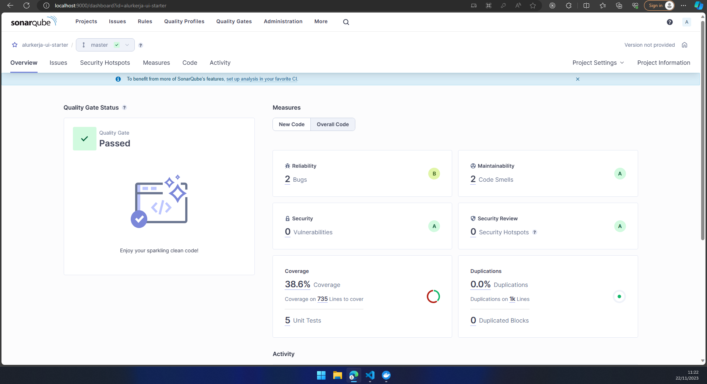
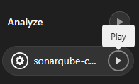

# Welcome to ALurkerja Starter

## Requirement

- node v18.14.2
- yarn v1.22.19
- sonarqube community edition v10.3 (untuk di local)
- extension vscode (prettier, sonarlint, eslint)

## Tech Stack

**Client:** React v18, React-Router-Dom v6, Typescript, Vite v3

**Testing:** Vitest, Testing-library

**Code Quality:** Eslint, Prettier, Airbnb Style Guides, sonar

**List Icon:** Lucide

## Running Locally

Clone the project

```bash
  git clone https://gitlab.javan.co.id/alurkerja/alurkerja-template/alurkerja-UI-starter.git
  cd alurkerja-UI-starter
  yarn install --frozen-lockfile
```

Copy paste env

1. create file .env.local
2. copy all from .env.example to .env.local

Start the server

```bash
  yarn dev
```

## Snippet Alurkerja

snippet alurkerja merupakan shortcut yang dapat digunakan untuk mempercepat penggunakan komponen alurkerja contohnya `tblc` untuk menggunakan component TableLowcode, `tblcf` untuk TableLowcode yang hanya perlu filter saja, `tblcstate` untuk megenerate semua state yang dibutuhkan TableLowcode. detailnya bisa check di `.vscode/alurkerja.code-snippets`

## [Dokumentasi Alurkerja (Here)](https://alurkerja-docs.vercel.app)

## Running Sonar Locally

1. jalanakan server docker untuk sonar `docker run -d --name sonarqube -e SONAR_ES_BOOTSTRAP_CHECKS_DISABLE=true -p 9000:9000 sonarqube:latest`
2. buka di browser `http://localhost:9000/` dan login, login pertama kali menggunakan credential username=admin, password=admin, nanti akan diminta ganti passwword dan login selanjutkan akan menggunakan password baru
3. buat project baru ikutin langkah2 nya sampai mendapatkan token
4. download sonar scanner [Sonar Scanner](https://docs.sonarsource.com/sonarqube/latest/try-out-sonarqube), unzip + edit env variable add sonar sonar scanner on it
5. pada file `sonar-project.properties` ganti `sonar.projectKey` dan `sonar.token` sesuai dengan informasi yang didapat ketika membuat project
6. jalankan test dengan command `yarn coverage`
7. buka terminal dan jalankan `sonar-scanner.bat`
8. hasilnya akan bisa dilihat di `http://localhost:9000/`



## Publish Sonar Scanner Report to sonar.javan.co.id

1. pada file `.gitlab-ci.yml` ganti {{project_key}} dengan nama project
2. commit kemudia push perubahannya & check pipeline kemudian klik `play` untuk menjalankan sonar scanner
   
